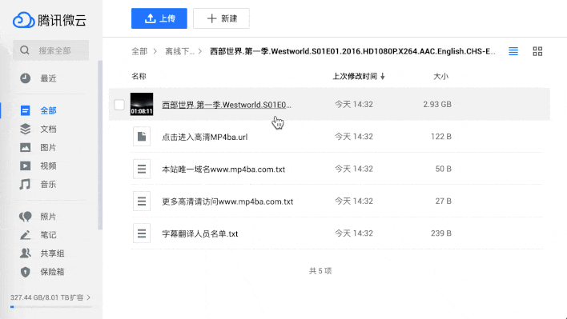
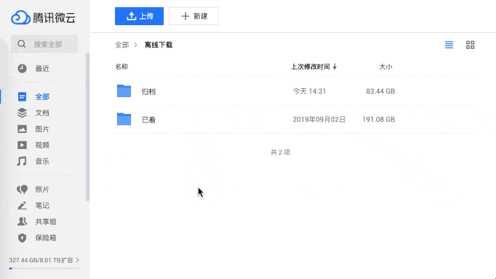

# WeiyunHelper

WeiyunHelper 是微云的辅助脚本，拥有以下功能：

- [x] 🔗 支持通过 JSON-RPC 推送至 Aria2 下载
- [ ] ~~🔗 下载文件时支持通过 AriaNg 下载~~
- [x] 🧲 支持粘贴自动（快捷）下载磁力链链接
- [x] 🎊 同时支持个人文件管理页和分享页的 Aria2 ~~AriaNG~~ 下载
- [ ] 💡 你有什么[想法](https://github.com/loo2k/WeiyunHelper/issues)？

## 如何使用

使用前需要先安装 [Tampermonkey](https://chrome.google.com/webstore/detail/tampermonkey/dhdgffkkebhmkfjojejmpbldmpobfkfo) 扩展，安装完成后访问下方的安装地址：

👉🏼 [https://greasyfork.org/zh-CN/scripts/402669-weiyunhelper](https://greasyfork.org/zh-CN/scripts/402669-weiyunhelper)

### ~~配置 AriaNg~~

~~因为目前没有直接调用 Aria2 的接口，依赖了 AriaNg 的服务。所以需要使用的用户使用 [http://aria2.pigfly.im/ariang/](http://aria2.pigfly.im/ariang/) 进行对应的设置后使用。~~

### 配置 Aria2 RPC 地址
此分支版改採 JSON-RPC 推送至 Aria2，並取消了 zip 打包下載，改支持一次性推送多檔。

請依照你的環境自行修改此地址變量。（目前沒有特別做一個 UI 方便你在頁面上設置...）
```
const JSON_RPC_URL='http://127.0.0.1:6800/jsonrpc';
```
\
备注：
- 目前暫時不另支持需要驗證的 JSON-RPC。若有需要請自行修改 ``aria2.addUri`` 的參數。（參考： [RPC authorization secret token](https://aria2.github.io/manual/en/html/aria2c.html#rpc-authorization-secret-token) ）
- ~~由于 aria2.me 和 ariang.mayswind.net 在国内的访问情况较差，所以使用了作者自建的 aria2.pigfly.im 服务（部署在腾讯云 CDN，默认为最新版本 AriaNg）~~
- ~~用户可以自行修改代码中的 AriaNg 服务地址~~
- 如果你希望支持直接调用 Aria2 的接口也可以发起 PR 贡献你的代码 :)     👈👈👈 請向原作者 [loo2k](https://github.com/loo2k/WeiyunHelper/issues) 發起 

## 功能概览

**🔗 下载文件时支持通过 AriaNg 下载**



**🧲 支持粘贴自动（快捷）下载磁力链链接**



## 声明

WeiyunHelper 仅供个人学习交流，严禁用于商业用途。
